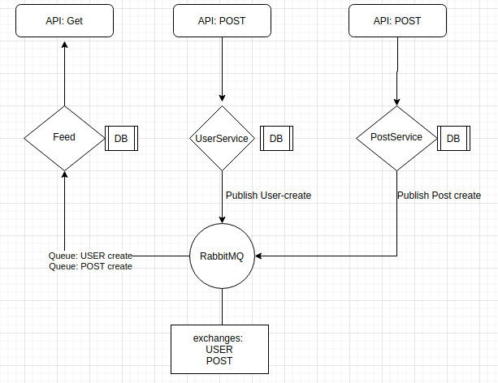

#### DESCRIPTION

Microservices environment based on RabbitMQ queuing system allowing to create a users, add posts and retrieve feed from posts (created after user's creation) 

#### SETUP
In order to launch the project, you just need to enter `docker-compose up --build` and v'oila

#### API
FeedService:
```GET localhost:5002/feed -h user: string```  - get feed

PostService:
```POST localhost:5001/post ``` {imgUrl: string} - add post

UserService:
```POST localhost:5000/user  ``` {email: string} - add user

#### TESTS
Each module has its own tests, both unit and e2e run from the command line

#### Architecture graphic :)


